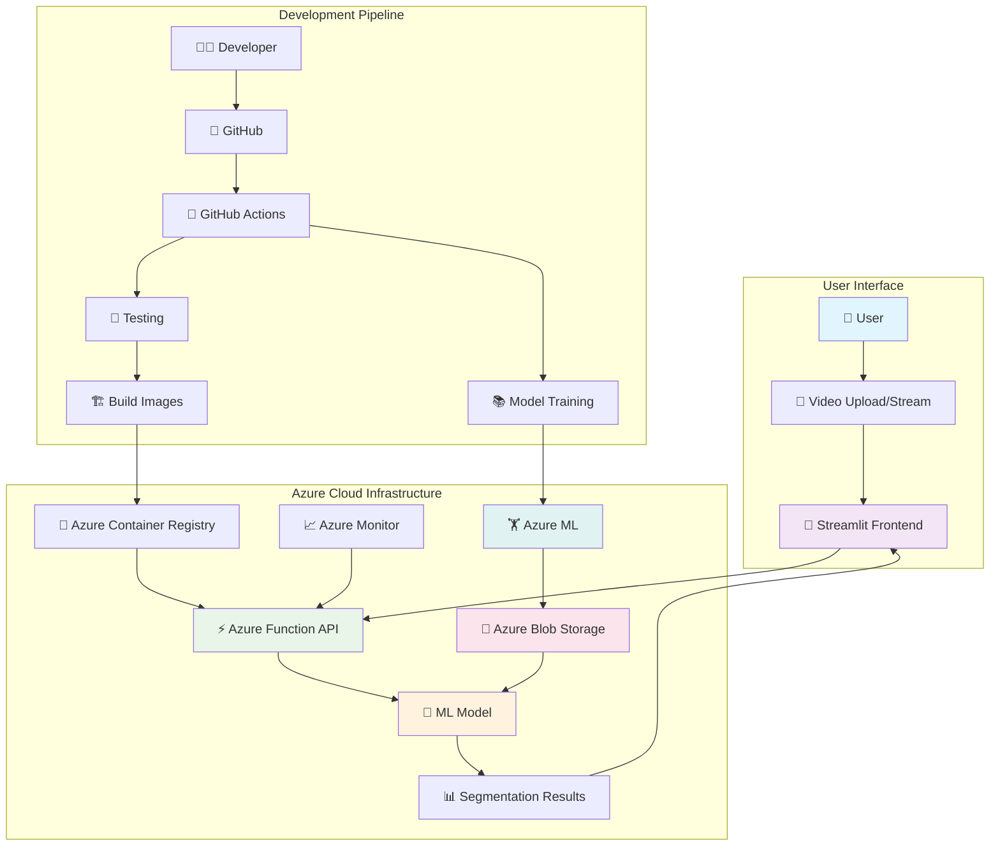
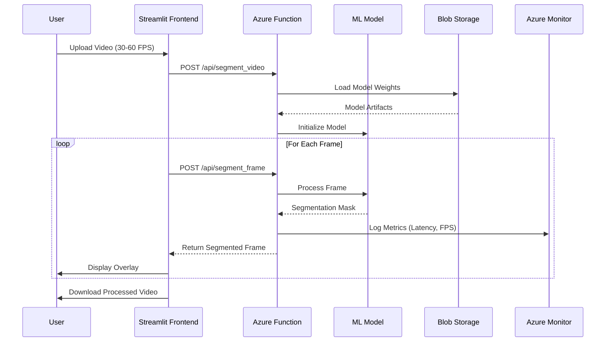
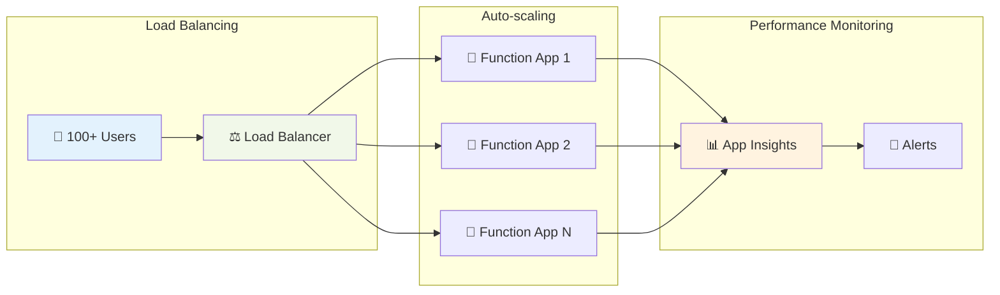
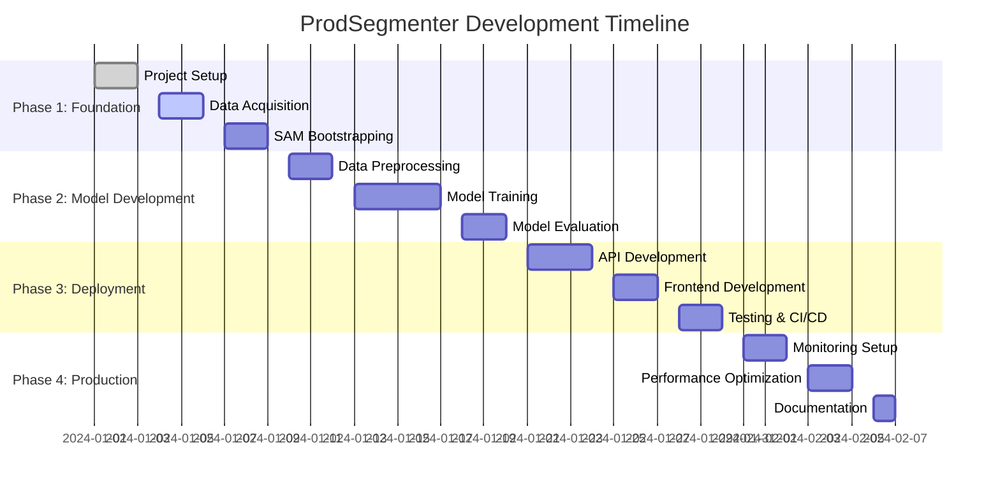
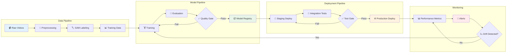
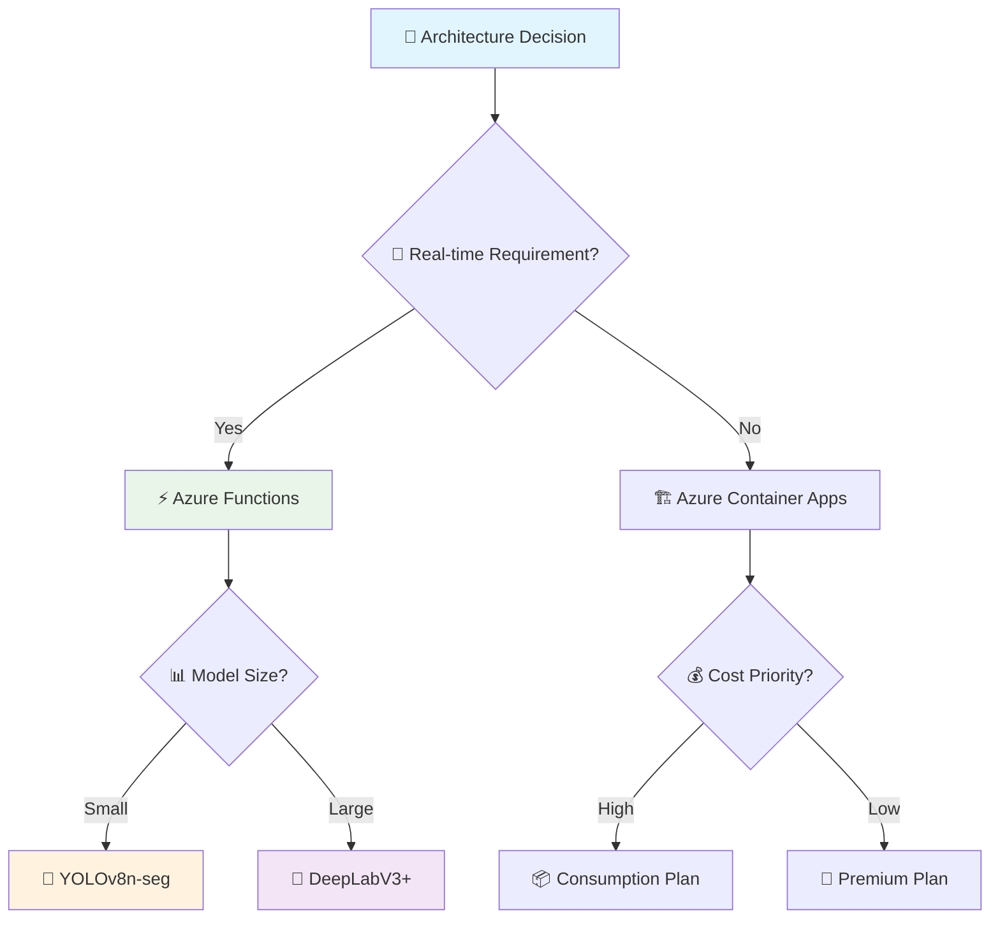

# ProdSegmenter

**Real-time semantic segmentation of products on grocery store shelves using Azure-native cloud infrastructure.**

[](https://github.com/your-org/prodsegmenter/actions)
[](https://azure.microsoft.com/en-us/services/machine-learning/)
[](https://www.python.org/downloads/release/python-3100/)
[](https://opensource.org/licenses/MIT)

---

## 🎯 Project Overview

ProdSegmenter is a full-stack computer vision system that performs **real-time semantic segmentation** of products on grocery store shelves from video input (30–60 FPS). The system identifies product regions, overlays segmented output on video streams, and provides a web-based interface for visualization and interaction.

### Key Features

- **🚀 Real-time Processing**: 30-60 FPS video segmentation
- **☁️ Azure-Native**: Fully hosted on Microsoft Azure cloud platform  
- **📈 Scalable Architecture**: Container-based deployment with auto-scaling
- **🎨 Web Interface**: Interactive Streamlit frontend for video upload and visualization
- **🔄 MLOps Pipeline**: Automated model training, evaluation, and deployment
- **🏗️ Production Ready**: Comprehensive testing, monitoring, and CI/CD

---

## 🏗️ System Architecture



### Data Flow Architecture



---

## ⚙️ Technology Stack

### Infrastructure & Compute
| Component | Technology | Purpose | SLA/Performance |
|-----------|------------|---------|-----------------|
| **Training** | Azure Machine Learning | Model training & experiments | 99.9% uptime |
| **Inference** | Azure Functions | Real-time API endpoints | <33ms latency |
| **Storage** | Azure Blob Storage | Data & model artifacts | 99.999% durability |
| **Frontend** | Azure App Service | Streamlit web interface | Auto-scaling |
| **Registry** | Azure Container Registry | Docker image management | Global replication |
| **Monitoring** | Azure Application Insights | Performance & error tracking | Real-time alerts |

### Machine Learning Stack
| Component | Technology | Use Case | Performance Target |
|-----------|------------|----------|-------------------|
| **Bootstrapping** | Segment Anything Model (SAM) | Initial mask generation | High quality masks |
| **Architecture** | DeepLabV3+/UNet/YOLOv8-Seg | Real-time segmentation | 30-60 FPS |
| **Framework** | PyTorch 2.0+ | Model development | GPU acceleration |
| **Optimization** | ONNX/TensorRT | Inference acceleration | <17ms per frame |
| **Tracking** | MLflow + Azure ML | Experiment management | Version control |

### Development & Deployment
| Tool | Purpose | Integration |
|------|---------|-------------|
| **GitHub Actions** | CI/CD pipeline | Automated testing & deployment |
| **Conda** | Environment management | Reproducible dependencies |
| **Pytest** | Testing framework | 80%+ code coverage |
| **Black/Flake8** | Code quality | Automated formatting |
| **Docker** | Containerization | Multi-stage builds |

---

## 📊 Performance Requirements

### Real-time Processing Targets

| Model Architecture | Input Size | Target FPS | Latency (ms) | mIoU | GPU Memory |
|-------------------|------------|------------|---------------|------|------------|
| **YOLOv8n-seg** | 640×640 | 60+ | <17 | 0.75+ | 2GB |
| **YOLOv8s-seg** | 640×640 | 45+ | <22 | 0.78+ | 3GB |
| **UNet-ResNet34** | 512×512 | 35+ | <28 | 0.80+ | 4GB |
| **DeepLabV3+-ResNet50** | 512×512 | 30+ | <33 | 0.82+ | 6GB |

### System Scalability



---

## 📁 Project Structure

```
prodsegmenter/
├── 📄 README.md                    # Project overview and setup
├── 📄 environment.yml              # Conda environment
├── 📄 prodsegmenter_config.yaml   # Project configuration
├── 📄 .gitignore                   # Git ignore rules
│
├── 📂 data/                        # Data storage and management
│   ├── raw/                        # Raw video files
│   ├── processed/                  # Processed frames and masks
│   └── README.md                   # Data documentation
│
├── 📂 notebooks/                   # Jupyter notebooks for exploration
│   ├── 01_download_dataset.ipynb   # Data acquisition
│   ├── 02_sam_bootstrap.ipynb      # SAM mask generation
│   ├── 03_preprocessing.ipynb      # Data preprocessing
│   └── README.md                   # Notebook documentation
│
├── 📂 models/                      # Model storage
│   ├── sam/                        # SAM model weights
│   ├── custom_segmentation/        # Custom trained models
│   └── README.md                   # Model documentation
│
├── 📂 training/                    # Training pipeline
│   ├── train.py                    # Model training script
│   ├── evaluate.py                 # Model evaluation
│   ├── dataset.py                  # Dataset classes
│   └── README.md                   # Training documentation
│
├── 📂 deployment/                  # Deployment assets
│   ├── azure_function/             # Azure Function API
│   ├── streamlit_frontend/         # Web interface
│   └── README.md                   # Deployment documentation
│
├── 📂 tests/                       # Test suite
│   ├── test_train.py               # Training tests
│   ├── test_inference.py           # Inference tests
│   └── README.md                   # Testing documentation
│
└── 📂 .github/                     # CI/CD workflows
    └── workflows/
        └── ci.yml                  # GitHub Actions CI
```

---

## 🚀 Quick Start Guide

### Prerequisites

- **Azure Subscription** with appropriate permissions
- **Git** installed locally
- **Conda/Miniconda** installed
- **Azure CLI** installed and configured

### 1. 🔧 Azure Environment Setup

```bash
# Login to Azure
az login

# Set your subscription
az account set --subscription "your-subscription-id"

# Create resource group
az group create --name rg-prodsegmenter --location eastus

# Create Azure ML workspace
az ml workspace create --name ml-prodsegmenter --resource-group rg-prodsegmenter
```

### 2. 📥 Project Setup

```bash
# Clone the repository
git clone https://github.com/your-org/prodsegmenter.git
cd prodsegmenter

# Create and activate conda environment
conda env create -f environment.yml
conda activate prodsegmenter

# Initialize git (if not cloned)
git init
git add .
git commit -m "Initial project setup"
```

### 3. ⚙️ Configuration

```bash
# Copy configuration template
cp prodsegmenter_config.yaml.template prodsegmenter_config.yaml

# Edit configuration with your Azure details
nano prodsegmenter_config.yaml
```

Set the following environment variables:
```bash
export AZURE_SUBSCRIPTION_ID="your-subscription-id"
export AZURE_RESOURCE_GROUP="rg-prodsegmenter"
export AZURE_ML_WORKSPACE="ml-prodsegmenter"
export AZURE_STORAGE_ACCOUNT="stprodsegmenter"
```

### 4. 🧪 Verification

```bash
# Test environment setup
python -c "import torch; print(f'PyTorch: {torch.__version__}'); print(f'CUDA available: {torch.cuda.is_available()}')"

# Test Azure connectivity
az ml workspace show --name ml-prodsegmenter --resource-group rg-prodsegmenter
```

---

## 📈 Development Workflow

### Phase-by-Phase Implementation



### 🔄 MLOps Pipeline



---

## 🧪 Development Commands

### Data Processing
```bash
# Extract and preprocess data
jupyter lab notebooks/01_download_dataset.ipynb

# Generate SAM masks
jupyter lab notebooks/02_sam_bootstrap.ipynb

# Prepare training data
jupyter lab notebooks/03_preprocessing.ipynb
```

### Model Training
```bash
# Local training (quick test)
cd training/
python train.py --config ../prodsegmenter_config.yaml --epochs 5

# Azure ML training (full)
python train.py --config ../prodsegmenter_config.yaml --azure
```

### Testing
```bash
# Run all tests
pytest tests/ -v --cov=training --cov=deployment

# Run specific test categories
pytest tests/test_train.py -v
pytest tests/test_inference.py -v
```

### Deployment
```bash
# Local development
cd deployment/streamlit_frontend/
streamlit run app.py

# Azure deployment
cd deployment/azure_function/
func azure functionapp publish func-prodsegmenter-inference
```

---

## 📊 Monitoring & Analytics

### Key Metrics Dashboard

| Metric Category | Key Indicators | Target Values | Alerting |
|----------------|----------------|---------------|----------|
| **Performance** | Response Time, FPS, Throughput | <33ms, >30 FPS, >100 req/s | >50ms response |
| **Accuracy** | mIoU, Pixel Accuracy, F1 Score | >0.80, >0.90, >0.85 | <0.75 mIoU |
| **Reliability** | Uptime, Error Rate, Success Rate | >99.9%, <1%, >99% | >5% error rate |
| **Resource** | CPU, Memory, GPU Utilization | <80%, <85%, <90% | >95% utilization |

### Architecture Decision Records (ADRs)



---

## 🤝 Contributing

### Development Process

1. **Fork** the repository
2. **Create** a feature branch: `git checkout -b feature-awesome-improvement`
3. **Make** changes and add tests
4. **Run** the test suite: `pytest tests/ --cov=80`
5. **Format** code: `black . && flake8 .`
6. **Submit** a pull request with detailed description

### Code Quality Standards

- **Test Coverage**: Minimum 80% overall, 95% for core modules
- **Documentation**: All public functions must have docstrings
- **Performance**: Real-time functions must meet latency requirements
- **Security**: All inputs must be validated and sanitized

---

## 📚 Additional Resources

### Documentation Links
- [📖 Azure ML Documentation](https://docs.microsoft.com/en-us/azure/machine-learning/)
- [🔧 Azure Functions Guide](https://docs.microsoft.com/en-us/azure/azure-functions/)
- [🎨 Streamlit Documentation](https://docs.streamlit.io/)
- [🤖 SAM Model Documentation](https://github.com/facebookresearch/segment-anything)

### Learning Resources
- [🎓 Computer Vision Course](https://cs231n.stanford.edu/)
- [☁️ Azure ML Learning Path](https://docs.microsoft.com/en-us/learn/paths/build-ai-solutions-with-azure-machine-learning-service/)
- [🐍 PyTorch Tutorials](https://pytorch.org/tutorials/)

---

## 📝 License

This project is licensed under the MIT License - see the [LICENSE](LICENSE) file for details.

## 🆘 Support & Contact

- **📧 Email**: support@prodsegmenter.com
- **💬 Discord**: [ProdSegmenter Community](https://discord.gg/prodsegmenter)
- **📚 Wiki**: [Documentation](https://github.com/your-org/prodsegmenter/wiki)
- **🐛 Issues**: [GitHub Issues](https://github.com/your-org/prodsegmenter/issues)

---

## 🎯 Current Status

**✅ Prompt 0 & 1 Complete**: Architecture defined, project bootstrapped, ready for data acquisition

**🚀 Next Steps**: 
- Proceed to Prompt 2: Download and organize grocery shelf datasets
- Set up SKU110K dataset processing
- Begin SAM bootstrap pipeline

---

*Built with ❤️ by the ProdSegmenter team using Azure cloud infrastructure* # ProdSegmenter
